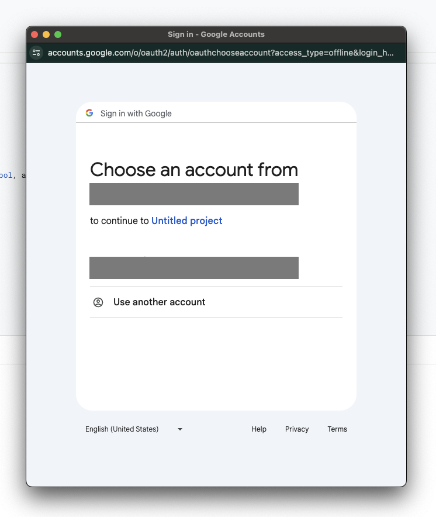

# Google Sheets Foxbit Integration

Este projeto tem como objetivo fornecer um passo a passo detalhado para integrar uma planilha do Google com a API da Foxbit. Através dessa integração, é possível obter e atualizar automaticamente os saldos de suas contas na Foxbit diretamente em uma aba específica da planilha.


## Preparação da planilha

Caso você ainda não tenha uma planilha do Google Sheets, crie um novo documento na sua conta Google.

> :lock:
> Este documento conterá credenciais de acesso à suas informações na Foxbit, então tome as providências necessárias para que pessoas não autorizadas não tenham acesso à este arquivo.


## Aba para armazenamento das credenciais de acesso à API da Foxbit

Crie uma aba com o nome `Variables`.

Configure a aba `Variables` com as seguintes linhas e colunas:

|key|value|
|---|---|
|FOXBIT_API_KEY|[SUA API KEY]|
|FOXBIT_API_SECRET|[SUA API SECRET]|

Exemplo:


> Substitua os valores `[SUA API KEY]` e `[SUA API SECRET]` pelos códigos gerados na plataforma da Foxbit (https://app.foxbit.com.br/profile/api-key).
> Tome cuidado com espaços no final e início dos códigos.


## Aba para armazenar os saldos

Crie uma aba com o nome `Balances`.

Configure a aba `Balances` com as seguintes linhas e colunas:

|source|tiker|quantity|updated_at|
|---|---|---|---|
|||||

Exemplo:


## Configuração do script

Este script irá obter os saldos de uma conta Foxbit utilizando a API REST v3 (https://docs.foxbit.com.br/rest/v3/).


### No menu, selecione `Extensions` / `Apps Script`


Copie e cole o seguinte código no arquivo Code.gs (gerado automaticamente):

```javascript
eval(UrlFetchApp.fetch('https://cdnjs.cloudflare.com/ajax/libs/crypto-js/4.1.1/crypto-js.min.js').getContentText());

const spreadsheet = SpreadsheetApp.getActive();
const variables = spreadsheet.getRange(`Variables!A2:B`).getValues();
let vars = {};
variables.forEach(i => vars[i[0]] = i[1]);

function updateExchangeBalances() {
  const foxbitClient = new FoxbitClient(vars.FOXBIT_API_KEY, vars.FOXBIT_API_SECRET);
  const balances = foxbitClient.getBlances();

  let entries = spreadsheet.getRange(`Balances!A2:D`).getValues();
  const lines = entries.length;
  const now = new Date();

  entries = balances.map(acc => [acc.sourceName, acc.symbol, acc.balance, now]);
  const assetsCount = entries.length;

  if (assetsCount < lines) {
    for (let i = 0; i < (lines - assetsCount); i++) {
      entries.push(['', '', '', '']);
    }
  }
  
  spreadsheet
    .getSheetByName('Balances')
    .getRange(`A2:D`)
    .setValues(entries);
}

class FoxbitClient {
  constructor(key, secret) {
    this.sourceName = 'Foxbit';
    this.key = key;
    this.secret = secret;
    this.basePath = 'https://api.foxbit.com.br';
  }

  sign(method, path, params, rawBody) {
    const timestamp = Date.now().toString();

    let queryString = Object.keys(params).map((key) => {
      return `${key}=${params[key]}`;
    }).join('&');

    const textToSign = `${timestamp}${method}${path}${queryString}${rawBody}`;
    const signature = CryptoJS.HmacSHA256(textToSign, this.secret).toString();

    console.log('textToSign:', textToSign);
    console.log('signature:', signature);

    return {
      timestamp: timestamp,
      signature: signature
    };
  }

  getBlances() {
    const method = 'GET';
    const path = '/rest/v3/accounts';
    
    const signatureData = this.sign(method, path, {}, '');

    const headers = {
      'User-Agent': 'Automation',
      'Content-Type': 'application/json',
      'X-FB-ACCESS-KEY': this.key,
      'X-FB-ACCESS-SIGNATURE': signatureData.signature,
      'X-FB-ACCESS-TIMESTAMP': signatureData.timestamp,
    };

    const options = {
      'method' : method,
      'headers' : headers,
    };

    const response = UrlFetchApp.fetch(`${this.basePath}${path}`, options);
    const data = JSON.parse(response.getContentText());

    const balances = data.data.filter(i => parseFloat(i.balance) > 0.0).map(account => {
      const balance = parseFloat(account.balance);
      if (balance == 0.0) return;
      return {
        sourceName: this.sourceName,
        symbol: account.currency_symbol.toUpperCase(),
        balance: balance,
      };
    });

    console.log('balances:', balances);

    return balances;
  }
}
```

Clique no botão `Run` com a função `updateExchangeBalances` selecionada.

Você deverá ver a seguinte janela pedindo permissão de execução do script:


Selecione a conta Google onde você criou a planilha:



Dê a permissão de execução de Apps Script para este documento:


A execução do script deve gerar um log parecido com este:


E por fim, você deve ter os seus saldos atualizados na aba `Balance` desta forma:


### Disclaimer

Este projeto é fornecido "no estado em que se encontra", sem garantias de qualquer tipo, expressas ou implícitas. A utilização deste script é de responsabilidade exclusiva do usuário. Não nos responsabilizamos por quaisquer danos diretos, indiretos, incidentais ou consequentes decorrentes do uso deste script. É altamente recomendado que o usuário tome todas as medidas de segurança necessárias para proteger suas credenciais e informações pessoais ao utilizar este script.
